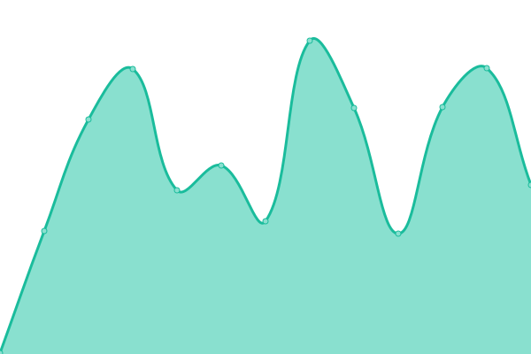

[The First Academy's Live Status Page](https://status.thefirstacademy.org/)

# [📈 Live Status](<[https://upptime.github.io/upptime](https://status.thefirstacademy.org/)>): <!--live status--> **🟩 All systems operational**

This repository contains the open-source uptime monitor and status page for [Upptime](https://upptime.js.org), powered by [Upptime](https://github.com/upptime/upptime).

With [Upptime](https://upptime.js.org), you can get your own unlimited and free uptime monitor and status page, powered entirely by a GitHub repository. We use [Issues](https://github.com/upptime/upptime/issues) as incident reports, [Actions](https://github.com/KeitheMyers/tfaUptime/actions) as uptime monitors, and [Pages](https://upptime.github.io/upptime) for the status page.

<!--start: status pages-->
<!-- This summary is generated by Upptime (https://github.com/upptime/upptime) -->
<!-- Do not edit this manually, your changes will be overwritten -->
<!-- prettier-ignore -->
| URL | Status | History | Response Time | Uptime |
| --- | ------ | ------- | ------------- | ------ |
|  [Canvas](https://thefirstacademy.instructure.com/) | 🟩 Up | [canvas.yml](https://github.com/i-TechSupport-orlando/tfaUptime/commits/HEAD/history/canvas.yml) | 

 724ms
     
 | 

<a href="https://status.thefirstacademy.org/history/canvas">100.00%</a>
    

|  [ClassLink LaunchPad](https://launchpad.classlink.com/thefirstacademy) | 🟩 Up | [class-link-launch-pad.yml](https://github.com/i-TechSupport-orlando/tfaUptime/commits/HEAD/history/class-link-launch-pad.yml) | 

 153ms
     
 | 

<a href="https://status.thefirstacademy.org/history/class-link-launch-pad">98.29%</a>
    

|  [DyKnow](https://dyknow.me/tfa) | 🟩 Up | [dy-know.yml](https://github.com/i-TechSupport-orlando/tfaUptime/commits/HEAD/history/dy-know.yml) | 

 1522ms
     
 | 

<a href="https://status.thefirstacademy.org/history/dy-know">99.82%</a>
    

|  [FACTS](https://renweb1.renweb.com/renweb1/#/Home) | 🟩 Up | [facts.yml](https://github.com/i-TechSupport-orlando/tfaUptime/commits/HEAD/history/facts.yml) | 

 163ms
     
 | 

<a href="https://status.thefirstacademy.org/history/facts">100.00%</a>
    

|  [FMX](https://tfa.gofmx.com/login) | 🟩 Up | [fmx.yml](https://github.com/i-TechSupport-orlando/tfaUptime/commits/HEAD/history/fmx.yml) | 

 437ms
     
 | 

<a href="https://status.thefirstacademy.org/history/fmx">100.00%</a>
    

|  [Google Classroom](https://classroom.google.com) | 🟩 Up | [google-classroom.yml](https://github.com/i-TechSupport-orlando/tfaUptime/commits/HEAD/history/google-classroom.yml) | 

 315ms
     
 | 

<a href="https://status.thefirstacademy.org/history/google-classroom">100.00%</a>
    

|  Jamf Pro Cloud | 🟩 Up | [jamf-pro-cloud.yml](https://github.com/i-TechSupport-orlando/tfaUptime/commits/HEAD/history/jamf-pro-cloud.yml) | 

 248ms
     
 | 

<a href="https://status.thefirstacademy.org/history/jamf-pro-cloud">100.00%</a>
    

|  Jamf Protect | 🟩 Up | [jamf-protect.yml](https://github.com/i-TechSupport-orlando/tfaUptime/commits/HEAD/history/jamf-protect.yml) | 

 320ms
     
 | 

<a href="https://status.thefirstacademy.org/history/jamf-protect">100.00%</a>
    

|  [uniFLOW Printing](https://status.uniflowonline.com/) | 🟩 Up | [uni-flow-printing.yml](https://github.com/i-TechSupport-orlando/tfaUptime/commits/HEAD/history/uni-flow-printing.yml) | 

 246ms
     
 | 

<a href="https://status.thefirstacademy.org/history/uni-flow-printing">100.00%</a>
    

<!--end: status pages-->

[**Visit our status website →**](https://upptime.github.io/upptime)

## 📄 License

- Powered by: [Upptime](https://github.com/upptime/upptime)
- Code: [MIT](./LICENSE) © [Anand Chowdhary](https://anandchowdhary.com), supported by [Pabio](https://pabio.com)
- Data in the `./history` directory: [Open Database License](https://opendatacommons.org/licenses/odbl/1-0/)
