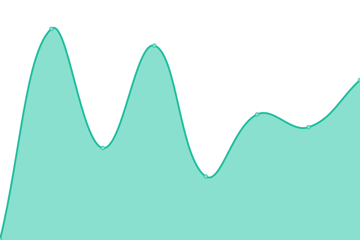

# [📈 Live Status](https://upptime.github.io/upptime): <!--live status--> **🟧 Partial outage**

This repository contains the open-source uptime monitor and status page for [Upptime](https://upptime.js.org), powered by [Upptime](https://github.com/upptime/upptime).

With [Upptime](https://upptime.js.org), you can get your own unlimited and free uptime monitor and status page, powered entirely by a GitHub repository. We use [Issues](https://github.com/upptime/upptime/issues) as incident reports, [Actions](https://github.com/Keith Myers/tfaUptime/actions) as uptime monitors, and [Pages](https://upptime.github.io/upptime) for the status page.

<!--start: status pages-->
<!-- This summary is generated by Upptime (https://github.com/upptime/upptime) -->
<!-- Do not edit this manually, your changes will be overwritten -->
<!-- prettier-ignore -->
| URL | Status | History | Response Time | Uptime |
| --- | ------ | ------- | ------------- | ------ |
|  JSS | 🟩 Up | [jss.yml](https://github.com/keithemyers/tfaUptime/commits/HEAD/history/jss.yml) | 

 418ms
     
 | 

<a href="https://keithemyers.github.io/tfaUptime/history/jss">45.18%</a>
    

|  [Google](https://www.google.com) | 🟩 Up | [google.yml](https://github.com/keithemyers/tfaUptime/commits/HEAD/history/google.yml) | 

 80ms
     
 | 

<a href="https://keithemyers.github.io/tfaUptime/history/google">100.00%</a>
    

|  [FACTS](https://renweb1.renweb.com/renweb1/#/Home) | 🟩 Up | [facts.yml](https://github.com/keithemyers/tfaUptime/commits/HEAD/history/facts.yml) | 

 131ms
     
 | 

<a href="https://keithemyers.github.io/tfaUptime/history/facts">100.00%</a>
    

|  [Google Classroom](https://classroom.google.com) | 🟩 Up | [google-classroom.yml](https://github.com/keithemyers/tfaUptime/commits/HEAD/history/google-classroom.yml) | 

 500ms
     
 | 

<a href="https://keithemyers.github.io/tfaUptime/history/google-classroom">100.00%</a>
    

|  [FMX](https://tfa.gofmx.com/login) | 🟩 Up | [fmx.yml](https://github.com/keithemyers/tfaUptime/commits/HEAD/history/fmx.yml) | 

 284ms
     
 | 

<a href="https://keithemyers.github.io/tfaUptime/history/fmx">100.00%</a>
    

|  [Canvas](https://thefirstacademy.instructure.com/) | 🟩 Up | [canvas.yml](https://github.com/keithemyers/tfaUptime/commits/HEAD/history/canvas.yml) | 

 541ms
     
 | 

<a href="https://keithemyers.github.io/tfaUptime/history/canvas">100.00%</a>
    

|  [ClassLink LaunchPad](https://launchpad.classlink.com/thefirstacademy) | 🟩 Up | [class-link-launch-pad.yml](https://github.com/keithemyers/tfaUptime/commits/HEAD/history/class-link-launch-pad.yml) | 

 140ms
     
 | 

<a href="https://keithemyers.github.io/tfaUptime/history/class-link-launch-pad">100.00%</a>
    

|  [Test Broken Site](https://thissitedoesnotexist.koj.co) | 🟥 Down | [test-broken-site.yml](https://github.com/keithemyers/tfaUptime/commits/HEAD/history/test-broken-site.yml) | 

 0ms
     
 | 

<a href="https://keithemyers.github.io/tfaUptime/history/test-broken-site">100.00%</a>
    

|  [IPv6 test](forwardemail.net) | 🟥 Down | [i-pv6-test.yml](https://github.com/keithemyers/tfaUptime/commits/HEAD/history/i-pv6-test.yml) | 

 0ms
     
 | 

<a href="https://keithemyers.github.io/tfaUptime/history/i-pv6-test">100.00%</a>
    

<!--end: status pages-->

[**Visit our status website →**](https://upptime.github.io/upptime)

## 📄 License

- Powered by: [Upptime](https://github.com/upptime/upptime)
- Code: [MIT](./LICENSE) © [Anand Chowdhary](https://anandchowdhary.com), supported by [Pabio](https://pabio.com)
- Data in the `./history` directory: [Open Database License](https://opendatacommons.org/licenses/odbl/1-0/)
